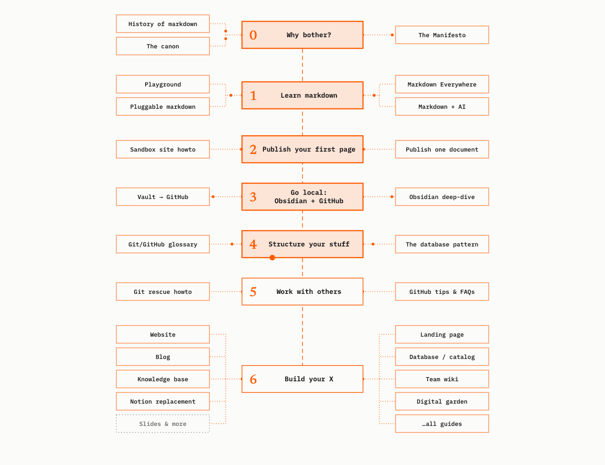
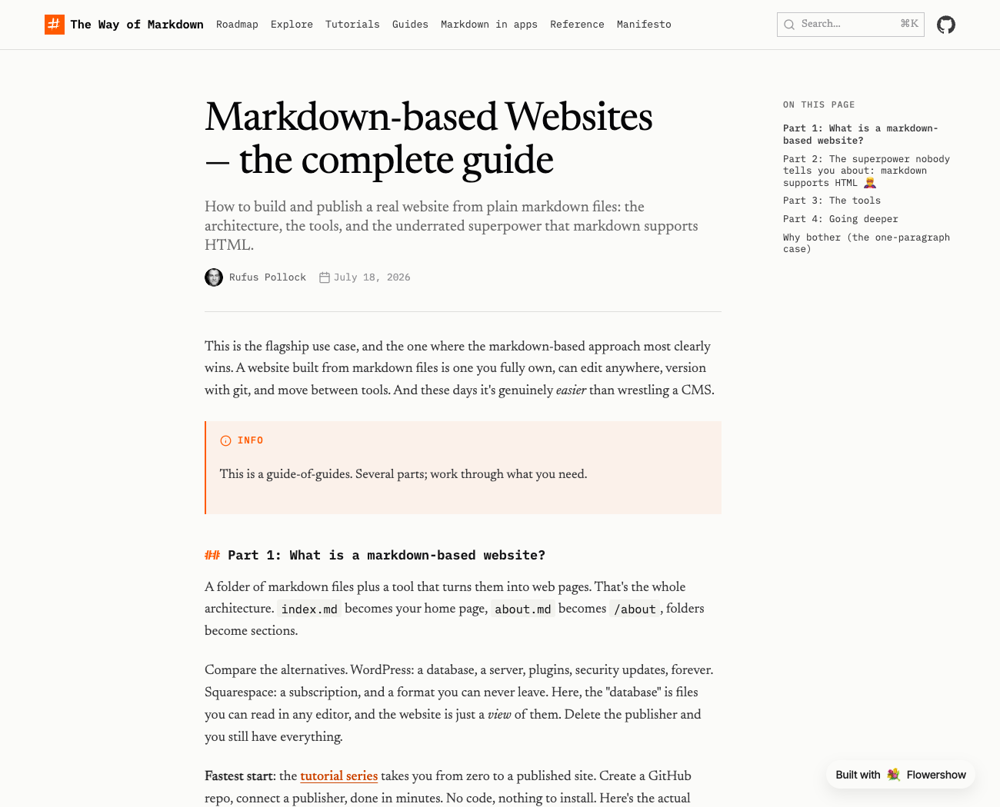

The site has a new design: a serif for reading, mono for structure, one orange, and a brush-stroke # in an orange square as the logo. The [front page](https://wayofmarkdown.com) has a contents list of every guide and a drawing of what's inside a markdown file. The story of how we got there, wrong turns included, is a blog post: [Finding a look for The Way of Markdown](https://wayofmarkdown.com/blog/2026-10-03-finding-a-look).

- The [roadmap](https://wayofmarkdown.com/roadmap) is redrawn as a spine with side trips, and it moves: a ball walks the route, each stage lights up as it arrives, and there's a small burst at the end.
- Guide pages get the new type, bylines with author pages, dates, and restyled callouts.

