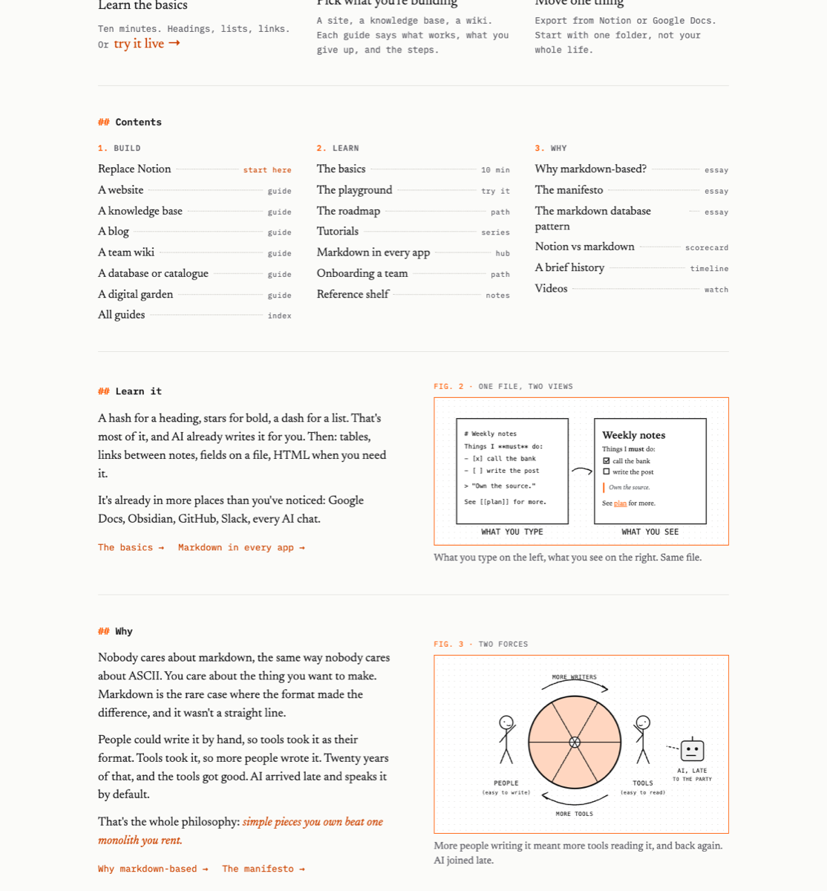

The site has a new design: serif text for reading, mono for structure, one orange, and a new front page with a contents list of every guide and drawings that show how markdown works. The logo is now a brush-stroke # in an orange square. See it live: [wayofmarkdown.com](https://wayofmarkdown.com).

