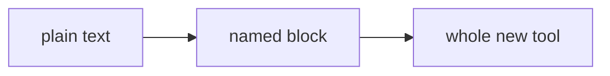

# Pluggable Markdown

Here's a feature of markdown that almost nobody frames properly: **markdown has a plugin system**, and it's been hiding in plain sight inside the triple-backtick block.

You know fenced code blocks:

````md
```python
print("hello")
```
````

The label after the backticks was originally just for syntax highlighting. But look at what it actually is: a **named, delimited region of plain text that tools can interpret however they like**. That's an extension point. Someone labels a block `mermaid` and suddenly markdown contains diagrams:

````md

````


(Yes, that rendered. This page is markdown.)

## What plugs in

- **Diagrams**: `mermaid` (flowcharts, sequence diagrams, gantt charts) — supported by GitHub, Obsidian, Flowershow and most modern renderers
- **Database views**: Obsidian's `dataview` blocks query your notes; Bases goes further: [the database pattern](markdown-database.md), living inside a fence
- **Maths**: `latex`/`math` blocks (and `$...$` inline in many tools)
- **Music, chemistry, charts**: `abc` notation, `smiles` molecules, chart-rendering blocks; the Obsidian plugin ecosystem alone has dozens
- **Interactive code**: Jupyter and Quarto execute fenced blocks and embed the *results* — a markdown file that runs
- And the degenerate case that proves the rule: unlabelled fences still just show code, and unknown labels degrade gracefully to plain text. **Old tools never break on new blocks.**

## Why this design is quietly brilliant

Most formats extend by growing their spec, and every tool must implement everything or fail. Markdown extends by *convention inside a container the spec already has*. The format stays tiny; the ecosystem grows unboundedly; nothing ever breaks. It's the same trick that made HTML's `<script>` tag world-changing, done in plain text.

Add the other two extension points — [inline HTML when you need real layout](markdown-websites.md) and frontmatter for [structured data](markdown-database.md) — and "just a formatting syntax" turns out to be a small, stable core with three clean sockets for infinite capability. None of that is an accident of design. See [why markdown is eating the world](manifesto.md).

More syntax fundamentals: [Markdown Basics](basics.md) · the full [everywhere list](everywhere.md)
